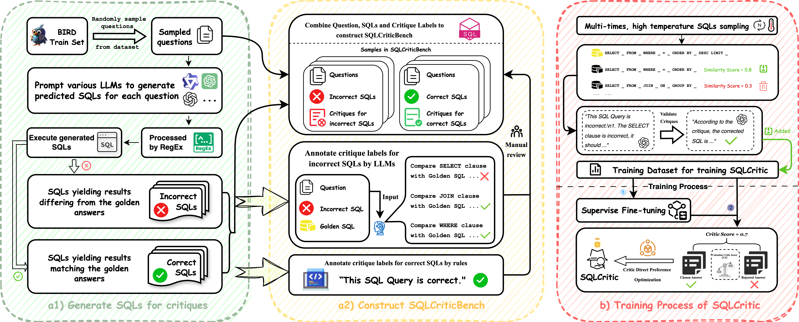

<h1 align="center">SQLCritic-Correcting-Text-to-SQL-Generation-via-Clause-wise-Critic</h1>

<div align="center">
<a href="./LICENSE"></a>
<a href="./LICENSE"></a>
<!-- <a href="加入huggingface链接"></a> -->
<a href="https://arxiv.org/abs/2503.07996" target="_blank"></a>
</div>

# 💡 Overview
**SQLCritic** is a novel critique model for Text-to-SQL systems that diagnoses and rewrites queries at the clause level, offering fine-grained feedback on SELECT, FROM, WHERE, GROUP BY and other components. It introduces clause-wise critique generation that pinpoints both syntactic and semantic flaws and is trained by an adaptive-β DPO training regime that dynamically adjusts the preference margin according to clause-level inconsistencies between preferred and dispreferred critiques, ensuring stable and precise corrections. Together, these advances make SQLCritic a reliable engine for error localization and correction in natural-language database interfaces.

- Paper: [arxiv](https://arxiv.org/abs/2503.07996)
- Model: Coming Soon...
- Dataset: Coming Soon...

# 🌐 Framework


<h5 align="center"> Fig. 1 Overall training framework of SQLCritic.</h5>

# 🔧 Dependencies
To begin using this repo, you need to create a conda environment and install the required dependencies.

```
conda create -n SQLCritic python=3.11
conda activate SQLCritic
pip install -r requirements.txt
```

# 📊 Datasets & Model Preparation
Download the BIRD and Spider datasets from their official website and put them under the path `datasets/bird` and `datasets/spider` respectively. And put the SQLCritic models under the path `models`.

# 🚀 Run the Agent
```
python src/main.py  --semantic_agent_path {path to SQLCritic model} --dataset_name bird --sql_file_path {sqls for correction under the path data/baselines} --output_dir {output path} --api_key {your openai api key} --base_url {base url for your api}
```

# ✍️ Citation
Please cite our repo if our works are helpful for your research.

```
@misc{chen2025sqlcriticcorrectingtexttosqlgeneration,
      title={SQLCritic: Correcting Text-to-SQL Generation via Clause-wise Critic},
      author={Jikai Chen and Leilei Gan and Ziyu Zhao and Zechuan Wang and Dong Wang and Chenyi Zhuang},
      year={2025},
      eprint={2503.07996},
      archivePrefix={arXiv},
      primaryClass={cs.AI},
      url={https://arxiv.org/abs/2503.07996},
}
```
